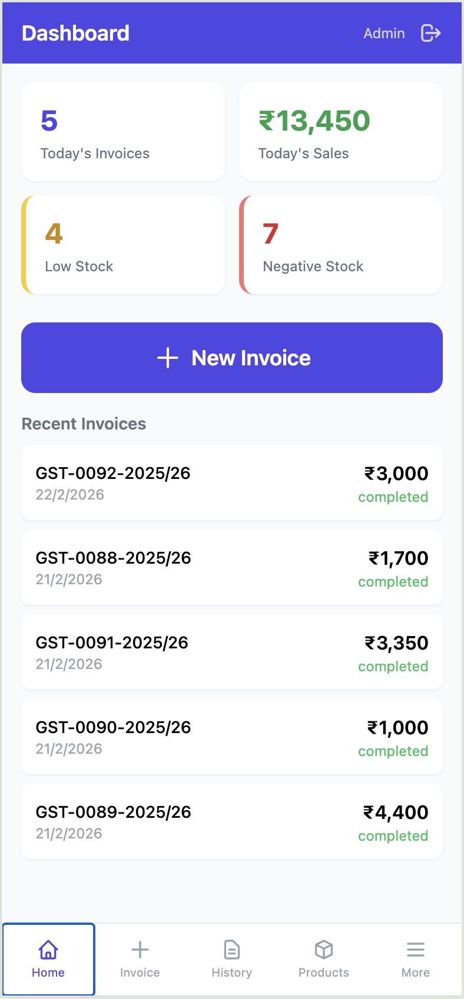
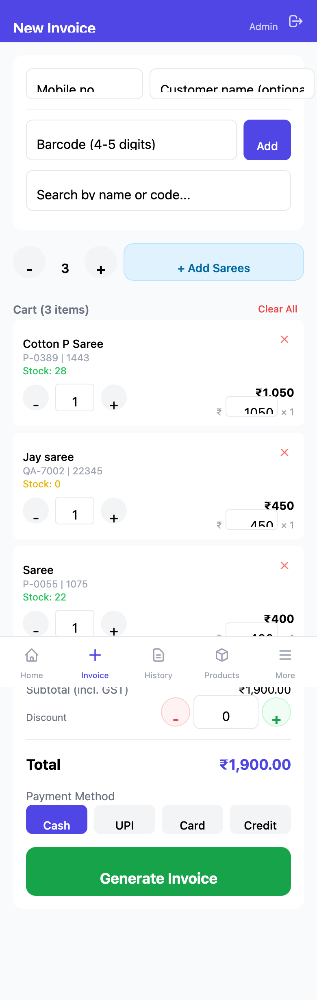
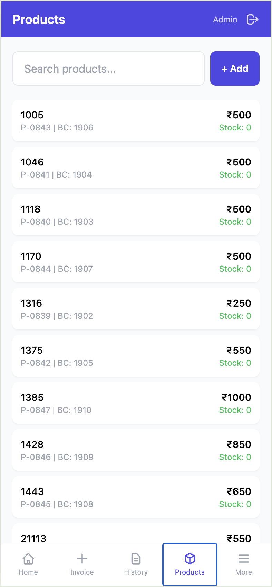
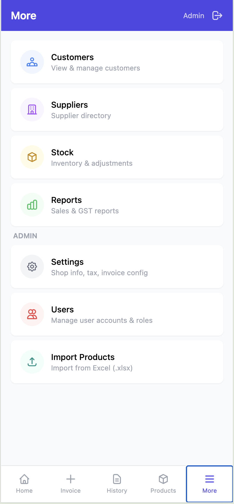
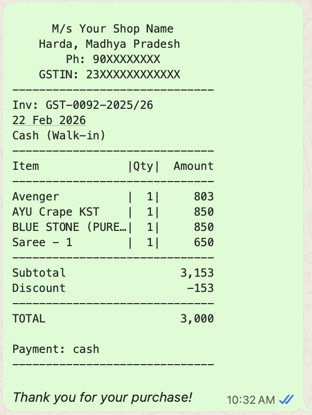

# Invoice Manager

A mobile-first POS and inventory management PWA — GST-compliant billing, product catalog, and stock tracking built for Indian retail shops.

<p align="center">
  
  
  
  
  
</p>

<p align="center">
  
  <br />
  <em>Invoice shared via WhatsApp</em>
</p>

## Features

- **Quick Billing** — camera barcode scanner, manual barcode lookup, search by name/code, bulk-add with "Add Sarees"
- **GST Calculations** — automatic CGST/SGST/IGST split with inclusive pricing, HSN codes
- **Multiple Payment Methods** — Cash, UPI (with QR code), Card, Credit
- **Invoice Sharing** — WhatsApp text share, print-ready view, image export
- **Product Catalog** — 1000+ products with barcode, MRP, stock levels, XLSX bulk import
- **Stock Management** — real-time stock tracking, low stock & negative stock alerts
- **Customer Management** — auto-lookup by mobile number, purchase history
- **Role-Based Access** — Admin, Manager, Salesperson, Viewer roles
- **Offline Support** — service worker caching, works without internet
- **Post-Invoice Adjustments** — modify totals after invoice creation

## Tech Stack

| Layer | Technology |
|-------|-----------|
| **Backend** | [PocketBase](https://pocketbase.io) (Go) — embedded SQLite, REST API, auth, hooks |
| **Frontend** | [Alpine.js](https://alpinejs.dev) + [Tailwind CSS](https://tailwindcss.com) — reactive UI, no build step |
| **PWA** | Service worker + manifest — installable on mobile, offline capable |

**Zero build tools.** No Node.js required for the frontend — just static HTML/JS/CSS served by PocketBase.

## Quick Start

### 1. Download PocketBase

Get the binary for your platform from [pocketbase.io/docs](https://pocketbase.io/docs/):

```bash
# macOS (Apple Silicon)
wget https://github.com/pocketbase/pocketbase/releases/download/v0.25.0/pocketbase_0.25.0_darwin_arm64.zip
unzip pocketbase_0.25.0_darwin_arm64.zip

# Linux
wget https://github.com/pocketbase/pocketbase/releases/download/v0.25.0/pocketbase_0.25.0_linux_amd64.zip
unzip pocketbase_0.25.0_linux_amd64.zip

# Windows — download the .exe from the releases page
```

Place the `pocketbase` binary (or `pocketbase.exe`) in the project root.

### 2. Start the Server

```bash
# Mac/Linux
./start.sh

# Windows
start.bat
```

The app will be available at **http://localhost:8090**

### 3. Initial Setup

1. Open **http://localhost:8090/_/** to access the PocketBase admin panel
2. Create a superuser account
3. Go to the app at **http://localhost:8090**
4. Create your first user account (Admin role)
5. Configure shop details in **Settings** (name, address, GSTIN, UPI ID)

## Importing Data

Bulk import products, suppliers, and historical invoices from Excel files:

```bash
cd scripts
npm install

# Set credentials as environment variables
export PB_ADMIN_EMAIL="your-admin@example.com"
export PB_ADMIN_PASSWORD="your-password"
export IMPORT_DATA_DIR="/path/to/your/excel/files"

node import-data.mjs
```

Expected Excel files in `IMPORT_DATA_DIR`:
- `Product Entry.xlsx` — product catalog
- `Supplir.xlsx` — supplier list
- `Sales Report.xlsx` — historical invoices

## Project Structure

```
├── pb_public/           # Frontend (served by PocketBase)
│   ├── index.html       # Single-page app (all views)
│   ├── js/
│   │   ├── api.js       # PocketBase API wrapper
│   │   ├── app.js       # Alpine.js store & cart logic
│   │   ├── lib/         # GST calc, discount logic, QR gen
│   │   └── pages/       # Page components (dashboard, invoice, products...)
│   ├── css/app.css      # Custom styles
│   ├── sw.js            # Service worker for offline support
│   └── manifest.json    # PWA manifest
├── pb_migrations/       # Database schema & seed data
├── pb_hooks/            # Server-side hooks (auto invoice numbering, stock updates)
├── scripts/             # Data import tools
│   ├── import-data.mjs  # Excel → PocketBase importer
│   └── tests/           # GST & discount calculation tests
├── start.sh             # Mac/Linux start script
└── start.bat            # Windows start script
```

## Invoice Numbering

Invoices are auto-numbered as `GST-XXXX-YYYY/YY` (e.g., `GST-0086-2025/26`). The prefix, counter, and financial year are configurable in Settings.

## GST Handling

- All prices are **GST-inclusive** by default
- Tax split: 2.5% CGST + 2.5% SGST (intra-state) or 5% IGST (inter-state)
- Taxable amount = Price ÷ 1.05
- HSN codes supported per product

## License

MIT
